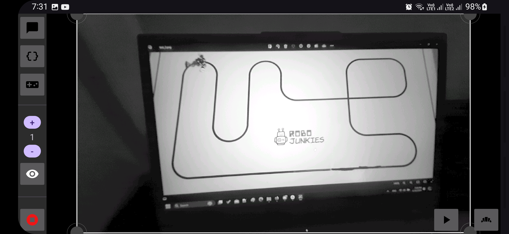
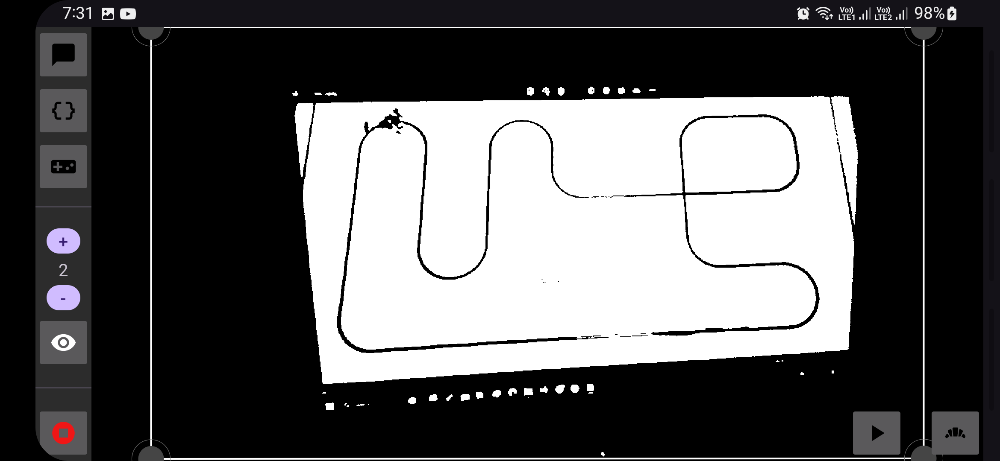
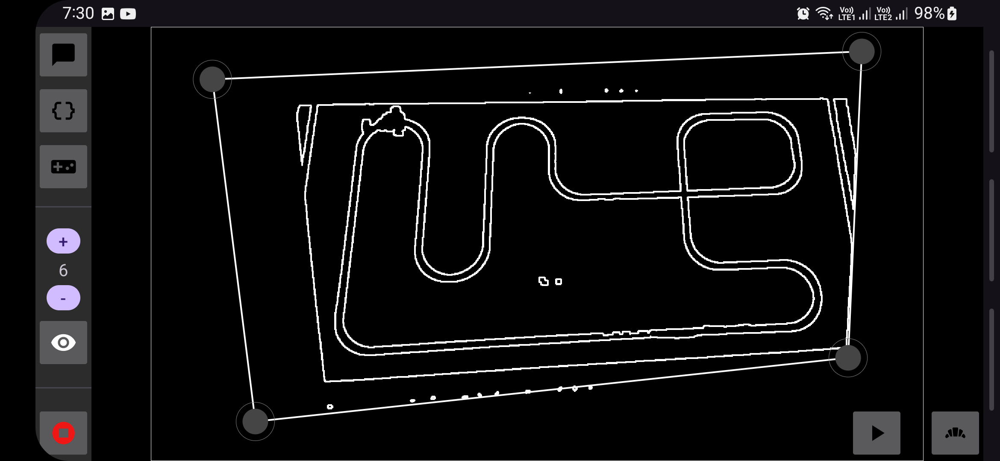
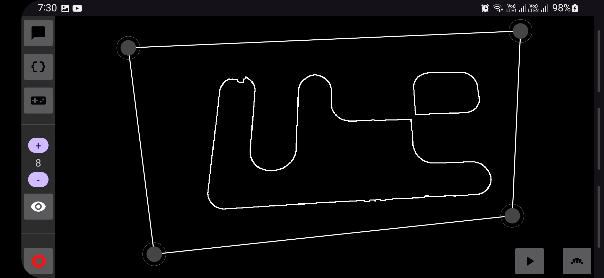
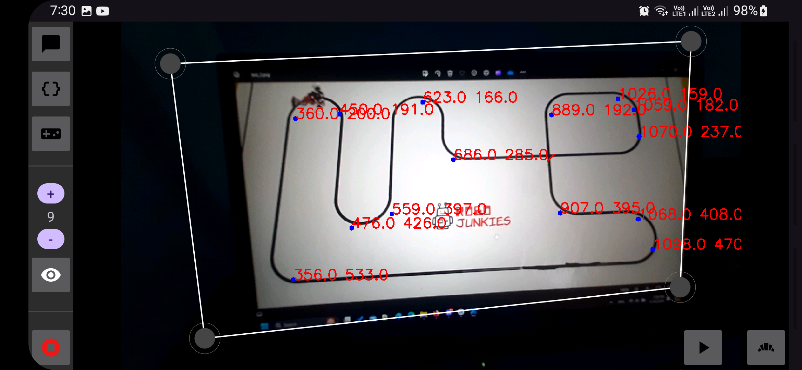

  
 
 
 SHARINGAN 

 
  
 

# 
 Overview 

a Kotlin android application used to communicate with a line follower robot to track its motion and control its speed whenever it's approching a turn using a bluetooth connection for data communication and opencv for image processing and computer vision techniques.

# 
 Features 

- Bluetooth Communication With Arduino
- Wide Camera Support
- Ability To Preview And Tune Hyperparameters Easily
- Fast Real-Time Processing With Minimal Lagging
- Ability To Solve Any Line Following Path 
- Supports Manual Communication And Control Over The Robot

# 
 Computer Vision 

In this part we will describe the full process of the computer vision including :- 
1. detection of the track
2. connecting the track nodes
3. detection of the car 
4. the actual line following process 

let's dive into these steps one at a time...

## 
 1- Detection Of The Track 

in this step the app has just connected with the robot bluetooth module. after fixing the phone used in a good position so that it's seeing the whole track just like an <b> Eagle Eye </b> we take a shot of the track.

this should begin preprocessing with initial values for the hyperparameters which includes (gamma correction value - minimum closed loop area in the track - maximum closed loop area in the track) which helps the app to work in different lighting environments and angles.

here are some examples of the <b> Preview Images </b> of a track
| | |
| --- | --- |
|  applying gamma correction |  segmentation using otsu threshold|
|  first level of contour detection |  removing noisy contours and keeping only no children contours|

 applying gamma correction

baking the track "or just pressing the not triangle button xD" will start this process of preprocessing. after fininshing you can check all the preprocessing steps to check if something went wrong. 

a track detection is successful iff the last image in the preview has a small line at every intersection of the track just like the last image above.

## 
 2- Constructing Track 

This part is pure problem solving. we used graph theory to connect the closed loop parts of the track - as it's easy to be detected using contour detection in tree mode - using the lines we mentioned it as important thing for a successful track detection opertaion.

the line itself is constructed simply by measuring the distance between every two points on the track. the line is the connection between two points with a certain maximum distance "<b> hyperparameter to be determined in the program not by the user </b>" and to be on different contours.

then we get the nearest points on both contours that line connects <b> from each side of the line </b>. the nearest points in calculated using euclidean distance.

each side of the line means that if the line is horizontal then we get the nearest point above the line and the nearest point below the line.

now we have 4 points 2 on each contour and both are in different side of the line.

for simplicity let's say if point in on contour x above the line then its PXA and PXB if it's below the line

then we connect points P1A with P2B and P1B with P2A.

knowing that the line follower must conatin Hamiltonian Path then this algorithm is guaranteed to work.

# 
 Steps 

1- download openCV (android version) : https://github.com/opencv/opencv/releases

2- Extract anywhere

3- from the extracted files, copy the folder "sdk" into the app folder (next to "app", "gradle", .. folders)

4- rename "sdk" to "opencv"

5- open the project in android studio and try to build

6- wait for it to build (you may need to wait some good amount of time)

7- and this should be it .. 

